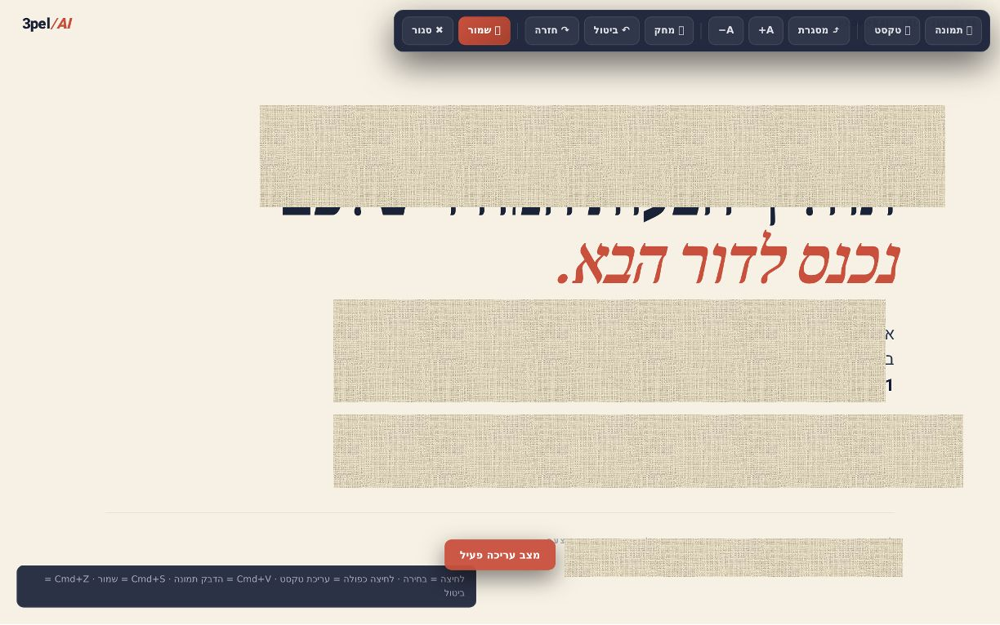

# Brain Edit Slides — fork with `page-edit-mode` sibling skill



## `page-edit-mode` — visual editor for single-page HTML

A Canva-style in-browser editor for **HTML proposals, landing pages, and editorial documents** — built by [Eliran Keren](https://github.com/Elirank1) for [3pel·AI](https://www.linkedin.com/in/elirankeren) sales-proposal workflows.

Use it when your HTML is one long scrolling page with `<section>` elements (flow layout) — not a slide deck. Edit text inline, recolor with brand swatches, paste screenshots, undo/redo, autosave to localStorage, save the edited file with Cmd+S. No server, no build, no dependencies.

**Install:**

```bash
python3 page-edit-mode/scripts/inject_editor.py path/to/proposal.html
```

**Full docs:** [`page-edit-mode/SKILL.md`](./page-edit-mode/SKILL.md)

### Why a sibling skill (not a patch)

The original `deck-edit-mode` (root of this repo) assumes `.slide` containers with absolute positioning — perfect for slide decks, breaks flow layout. So `page-edit-mode`:

- **Keeps:** inline text edit, color swatches (whole element OR selected word), image paste (Cmd+V), Cmd+C/V/D for cloning, undo/redo, autosave, Cmd+S export, counter baking, URL absolutization
- **Drops:** drag-to-move, snap-guides, arrow-nudge, blur/shape elements, z-order — none apply in flow layout
- **Replaces:** save model keyed by `<section id>` instead of slide index; canvas root configurable via `window.__brainEdConfig.rootSelector`; default palette is ink (`#1A2238`) + terra (`#C8503D`) tuned for `3pel·AI` proposals

The injector strips any previously-installed `deck-edit-mode` block before injecting, so a single HTML file can switch between the two without `#ed-fab` collisions.

### Quick decision: which skill for which file?

| Use `page-edit-mode` when | Use `deck-edit-mode` when |
|---|---|
| Single scrolling page with `<section>` elements | `<div id="deck">` with `.slide` children |
| Flow layout (grid, flex, normal block flow) | Absolute positioning inside a scaled stage |
| Proposals, landing pages, articles | Pitch decks, presentations, slide-based stories |

---

## Original `deck-edit-mode` (below)

The original deck-edit-mode skill (root files: `SKILL.md`, `scripts/`) is unchanged in this fork — all credit to its author. Use it for actual slide decks.

---

# Deck Edit Mode ✏️

**מצב עריכה ויזואלי (בסגנון Canva) לכל מצגת HTML שנבנתה עם Claude Code.**

יצרתם מצגת HTML מהממת עם Claude - אבל כל תיקון קטן דורש עוד פרומפט?
החבילה הזו מוסיפה למצגת כפתור **✏️ עריכה** שהופך אותה לעריכה חיה בדפדפן:
גוררים, מקלידים, מדביקים צילומי מסך - ושומרים. בלי שרת, בלי התקנות,
הכל נשאר בקובץ HTML אחד.


## מה אפשר לעשות במצב עריכה

| | |
|---|---|
| 🖱️ **הזזה חופשית** | לחיצה בוחרת, גרירה מזיזה - עם קווי הצמדה למרכז |
| ✍️ **עריכת טקסט** | לחיצה כפולה על כל טקסט - מקלידים ישר על השקף (Esc מבטל) |
| 📋 **הדבקת צילום מסך** | צילמתם מסך? Cmd+V והוא על השקף. אפשר גם לגרור תמונה מהמחשב |
| 📑 **העתק-הדבק אלמנטים** | Cmd+C / Cmd+V על כל אלמנט בשקף, Cmd+D לשכפול |
| 🎨 **צבעים** | עיגולי צבע + גרדיאנט - לכל האלמנט או רק למילה מסומנת |
| 🌫️ **טשטוש / הסתרה** | פאנל טשטוש לכיסוי נתון רגיש, כולל מצב אטום |
| 🎯 **דיוק** | חצים = פיקסל (Shift = 10), כפתורי מרכוז, שכבות קדימה/אחורה |
| ↩️ **ביטול/חזרה** | Cmd+Z / Cmd+Shift+Z + גיבוי אוטומטי בדפדפן עם שחזור |
| 💾 **שמירה** | Cmd+S מוריד את הקובץ הערוך - מחליפים את המקורי וזהו |

## התקנה (2 דקות, Claude עושה הכל)

1. הורידו את הריפו (Code → Download ZIP) או:
   ```bash
   git clone https://github.com/<USER>/deck-edit-mode.git
   ```
2. פתחו את Claude Code והדביקו:
   ```
   התקן לי את הסקיל שנמצא בתיקייה deck-edit-mode:
   העתק אותה אל ‎.claude/skills/deck-edit-mode בפרויקט שלי (או ~/.claude/skills),
   ואז הוסף את מצב העריכה למצגת האחרונה שיצרת לי.
   ```
3. זהו. מעכשיו **כל מצגת חדשה ש-Claude יוצר לכם תקבל את מצב העריכה
   אוטומטית**, ותוכלו לבקש ממנו להוסיף אותו גם למצגות ישנות.

> 💡 אפשר גם בלי סקיל: `python3 scripts/inject_editor.py path/to/deck.html`
> על כל קובץ מצגת - וזה בפנים.

## זה יעבוד על המצגת שלי?

כנראה שכן. העורך מותאם למבנה הנפוץ של מצגות שClaude מייצר (קונטיינר
במידות קבועות + שקפים עם `class="slide"`). אם המצגת שלכם בנויה אחרת -
זה בדיוק התפקיד של הסקיל: Claude קורא את המבנה של המצגת שלכם ומתאים
את ההזרקה אליה (הכל מוסבר לו ב-SKILL.md). תמיד נשמר גיבוי לפני.

## מה בפנים

```
deck-edit-mode/
├── SKILL.md                  # הוראות ל-Claude (סקיל מלא)
├── README.md
└── scripts/
    ├── editor.js             # מנוע העריכה (vanilla JS, ללא תלויות)
    ├── editor.css            # עיצוב סרגל הכלים והעורך
    └── inject_editor.py      # מזריק/משדרג את העורך בקובץ מצגת
```

- **אפס תלויות** - JS/CSS טהורים, רץ מקובץ מקומי (file://)
- **אדיטיבי** - לא נוגע בתוכן המצגת; הרצה חוזרת משדרגת במקום
- **שמירה חכמה** - בייצוא הנתיבים הופכים אבסולוטיים (רקעים ופונטים
  לא נשברים) ומספרים מונפשים "נאפים" לערכם הסופי

---

Built with Claude Code 🤖 · Shared by [Brain by Eden Bibas](https://brainai.co.il)
